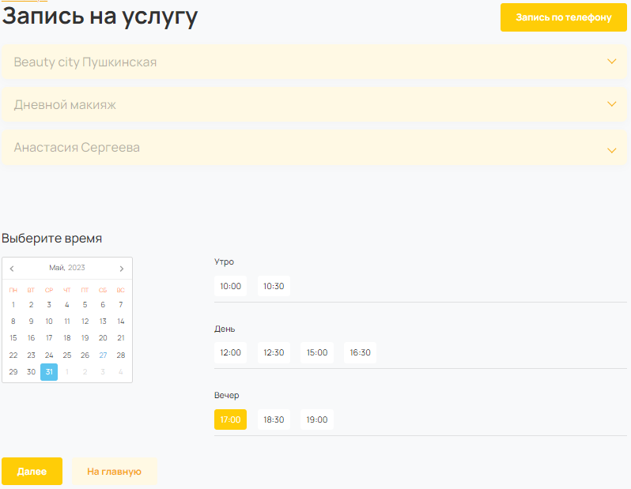

# Beauty city

This is a Django-based website. A user can sign up for a service in a beauty salon.




## Prerequisites

Python 3.11 is required.

## Installation

- Download the project files.
- It is recommended to use [venv](https://docs.python.org/3/library/venv.html?highlight=venv#module-venv) for project isolation.
- Set up packages:

```bash
pip install -r requirements.txt
```

- Set up environmental variables in your operating system or in the .env file. The variables are:

  - `DEBUG` is a boolean that turns on/off debug mode (optional, `True` by default);
  - `ALLOWED_HOSTS` is a list of strings representing the host/domain names that this Django site can serve (obligatory when `DEBUG` is set to `False`);
  - `SECRET_KEY` is a secret key for this installation (obligatory); this key is used to provide cryptographic signing, and should be set to a unique, unpredictable value;
  - `TIME_ZONE` is a string representing the time zone for this installation (optional, `Europe/Moscow` by default);
  - `DOMAIN` is a URL for this installation (obligatory);
  - `STRIPE_PUBLIC_KEY` is a public key that is necessary for the [Stripe payment system](https://stripe.com/docs) (obligatory);
  - `STRIPE_SECRET_KEY` is a secret key that is necessary for the [Stripe payment system](https://stripe.com/docs) (obligatory);
  - `STRIPE_WEBHOOK_SECRET` is a webhook secret that is necessary for the [Stripe payment system](https://stripe.com/docs) (obligatory);
  - `BOX_STRIPE_ID` is a box ID that is necessary for the [Stripe payment system](https://stripe.com/docs) (obligatory);

To set up variables in .env file, create it in the root directory of the project and fill it up like this:

```bash
DEBUG=True
SECRET_KEY=replace_me
ALLOWED_HOSTS=localhost,127.0.0.1
TIME_ZONE=Canada/Central
DOMAIN=https://example.com
STRIPE_PUBLIC_KEY=replace_me
STRIPE_SECRET_KEY=replace_me
STRIPE_WEBHOOK_SECRET=replace_me
BOX_STRIPE_ID=replace_me
```

- Create SQLite database:

```bash
python manage.py migrate
```

- Create a superuser:

```bash
python manage.py createsuperuser
```

## Usage

- Run a development server:

```bash
python manage.py runserver
```

- Go to [the admin site](http://127.0.0.1:8000/admin/) and fill the base;
- Go to [the home page](http://127.0.0.1:8000/).

## Project goals

The project was created for educational purposes.
It's a group project for python and web developers at [Devman](https://dvmn.org).
